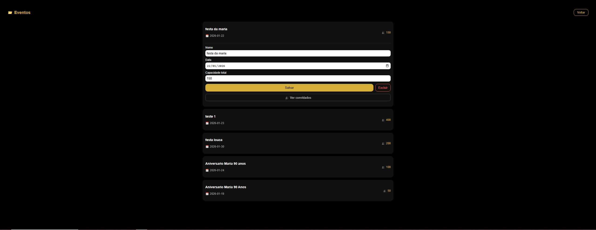
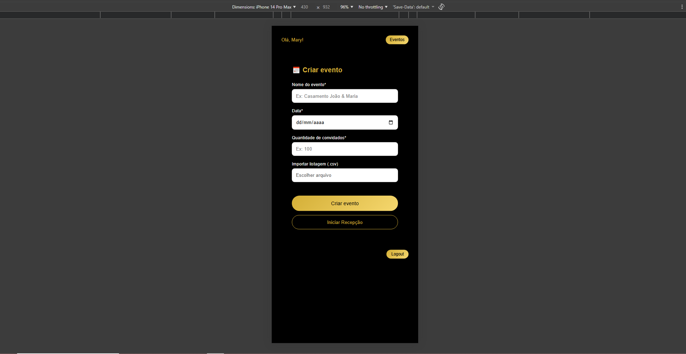
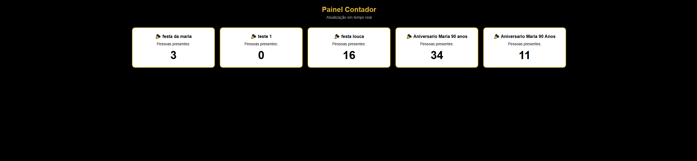
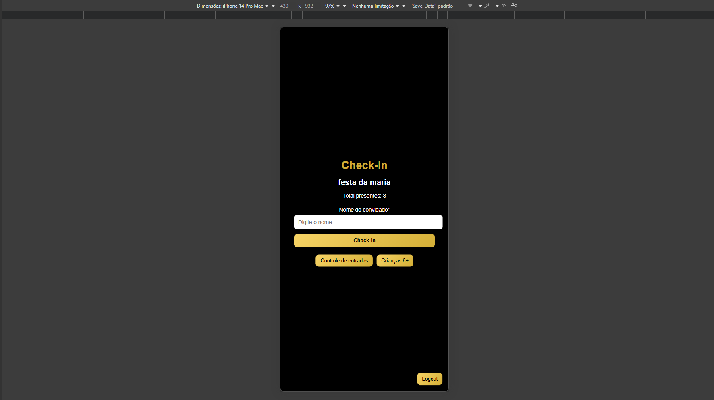

# 🎯 Recepção Digital - Sistema de Gestão de Eventos

Sistema de recepção e controle de convidados desenvolvido para gerenciamento de eventos.

O projeto permite cadastro, importação e controle de presença de convidados de forma prática e organizada.

---

## 🚀 Tecnologias Utilizadas

- Node.js
- Express
- SQLite
- Dotenv
- Arquitetura modular (Controller / Service / Routes)
- Manipulação de arquivos CSV (Node FS + Readline)

---

## 🧱 Arquitetura

O projeto segue separação em camadas:

src/
├── controllers → Camada responsável por lidar com requisição/resposta  
├── services → Regras de negócio  
├── routes → Definição das rotas  
├── middlewares → Tratamento intermediário  
├── database → Conexão e estrutura do banco  
└── server.js → Inicialização da aplicação  

A lógica de negócio é desacoplada da camada de rotas, facilitando futura refatoração e escalabilidade.

---

## ⚙️ Funcionalidades Implementadas

- Sistema de autenticação
- Gestão de eventos
- Cadastro manual de convidados
- Importação de convidados via CSV
- Controle de presença (check-in)
- Organização por múltiplos eventos
- Persistência em banco SQLite

---

## 📊 Conceitos Técnicos Aplicados

- Separação de responsabilidades
- Estruturação modular de backend
- Manipulação de arquivos via Stream
- Uso de variáveis de ambiente (.env)
- Organização de fluxo de dados
- Tratamento básico de erros
- Controle de fluxo assíncrono

  🔄 Roadmap Técnico (Evolução Planejada)

- Refatoração completa para TypeScript
- Implementação de DTOs e tipagem forte
- Introdução de validação com middleware (ex: Zod ou Joi)
- Autenticação baseada em JWT
- Implementação de testes automatizados
- Migração para banco relacional escalável (PostgreSQL)
- Aplicação de princípios de Clean Architecture

  ---

## 📸 Preview

---
